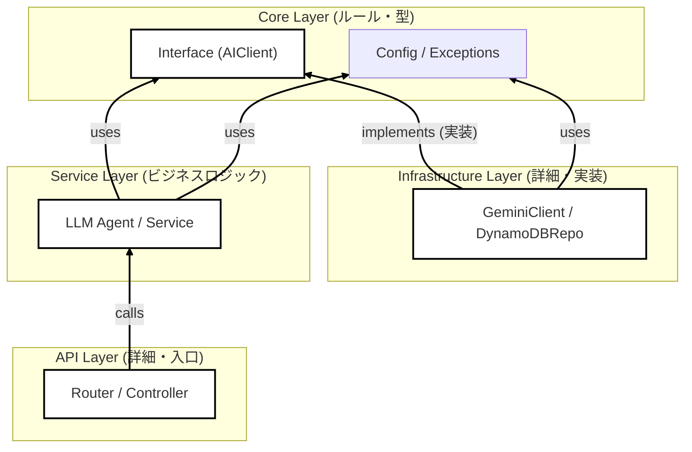
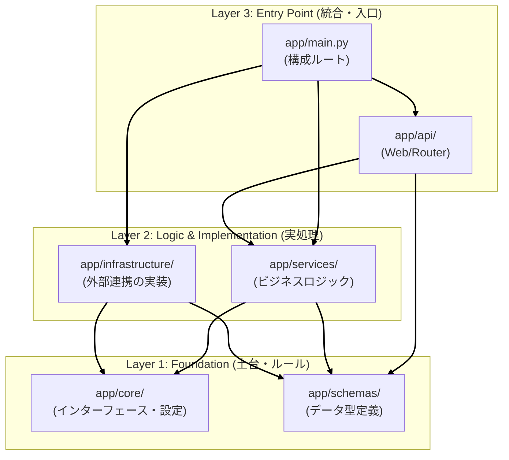

# アーキテクチャ図

```mermaid
    graph BT
    %% クラス・レイヤー定義
    subgraph "Infrastructure Layer (詳細・実装)"
        Infra[GeminiClient / DynamoDBRepo]
        style Infra fill:white,stroke:black,stroke-width:2px
    end

    subgraph "API Layer (詳細・入口)"
        Router[Router / Controller]
        style Router fill:white,stroke:black,stroke-width:2px
    end

    subgraph "Service Layer (ビジネスロジック)"
        Agent[LLM Agent / Service]
        style Agent fill:white,stroke:black,stroke-width:2px
    end

    subgraph "Core Layer (ルール・型)"
        Interface["Interface (AIClient)"]
        Config[Config / Exceptions]
        style Interface fill:white,stroke:black,stroke-width:2px
    end

    %% 依存関係 (矢印は import の方向)
    Infra -- "implements (実装)" --> Interface
    Router -- "calls" --> Agent
    Agent -- "uses" --> Interface
    Agent -- "uses" --> Config
    Infra -- "uses" --> Config

    %% ServiceはInfraを絶対知らない
    linkStyle 0,1,2,3,4 stroke-width:2px,fill:none,stroke:black;
```

```mermaid
graph TD
    %% レイヤー定義
    subgraph "Layer 3: Entry Point (統合・入口)"
        Main["app/main.py<br/>(構成ルート)"]
        API["app/api/<br/>(Web/Router)"]
    end

    subgraph "Layer 2: Logic & Implementation (実処理)"
        Service["app/services/<br/>(ビジネスロジック)"]
        Infra["app/infrastructure/<br/>(外部連携の実装)"]
    end

    subgraph "Layer 1: Foundation (土台・ルール)"
        Core["app/core/<br/>(インターフェース・設定)"]
        Schema["app/schemas/<br/>(データ型定義)"]
    end

    %% 依存関係 (Importの方向)
    Main --> API
    Main --> Service
    Main --> Infra

    API --> Service
    API --> Schema

    Service --> Core
    Service --> Schema

    Infra --> Core
    Infra --> Schema

    %% ServiceとInfraは互いに依存しない (重要)
    linkStyle default stroke-width:2px,fill:none,stroke:black;
```
